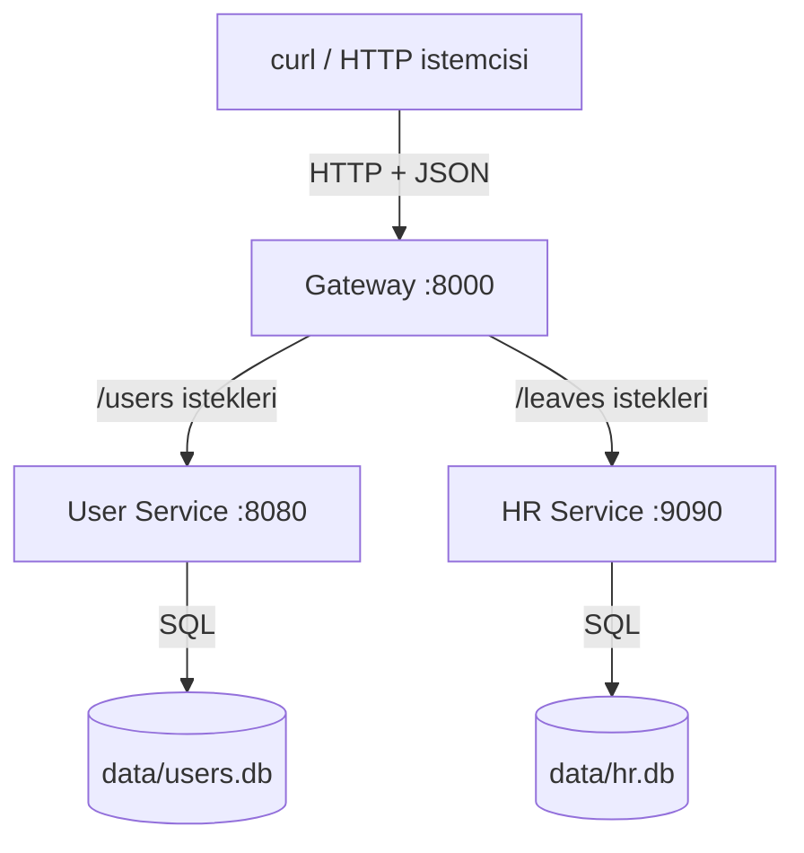
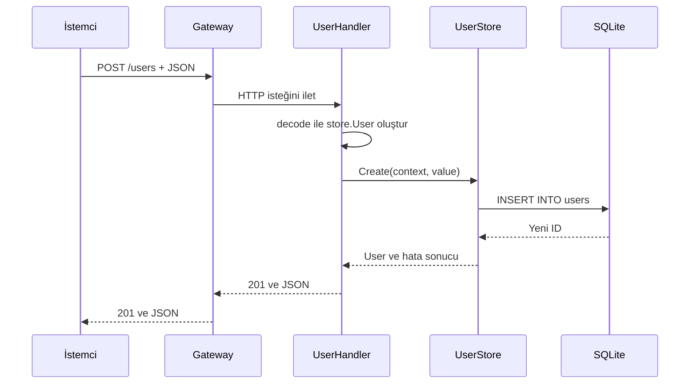

# REST sürümü: bir HTTP isteği kodda nasıl ilerler?

Bu rehber, projeyi ilk kez gören biri için hazırlanmıştır. Önce [ortak kavramlar rehberini](../README.md) okuyabilirsin. Burada HTTP isteğini gerçek dosya ve fonksiyonları takip ederek veritabanına kadar izleyeceğiz.

## REST, HTTP ve JSON ne demek?

Bu projede bir kaynağa adresi ve yapmak istediğin işlemle ulaşırsın. **HTTP metodu**, yapılacak işi söyler: `GET` oku, `POST` ekle, `PUT` güncelle, `DELETE` sil. **Endpoint**, isteğin gittiği API adresidir; `/users` bunun bir örneğidir. `{id}` ise gerçek kayıt numarasıyla değiştirilecek bölümdür: `/users/7` gibi.

**JSON**, veriyi anahtar–değer çiftleri halinde metin olarak taşıma biçimidir:

```json
{"name":"Ada","email":"ada@example.com","address":"Ankara"}
```

Bu JSON'daki `name` bir alan adı, `Ada` o alanın değeridir. İstek gövdesi (**body**) bu veriyi taşır. Cevapta da durum kodu ve gerektiğinde JSON bulunur.

## Mimari



Dışarıdan `8000` portuna istek gönderirsin. Gateway isteği uygun servise iletir. İlgili servis JSON'u Go verisine dönüştürür, SQL işlemini yaptırır ve cevabı döndürür. **Gateway'in veritabanı bağlantısı yoktur.** HR Service de kullanıcıyı doğrulamak için User Service'e gitmez.

## Çalıştırma: önce uygulamayı görelim

Go 1.23 veya üzeri gerekir. Kolay başlatma scripti Bash 4.3+ kullanır; aşağıdaki komutları **Fish terminaline doğrudan yapıştırabilirsin**. Script kendi ilk satırı sayesinde Bash ile çalışır. İlk çalıştırmada Go bağımlılıklarının indirilmesi için internet gerekir. SQLite için Docker veya ayrı bir veritabanı kurulumu gerekmez.

Terminal 1:

```fish
cd /home/ykk/PROJE/project-rest
./scripts/run.sh
```

[scripts/run.sh](scripts/run.sh) sırasıyla şunları yapar:

1. `go build` ile `migrate`, `user-service`, `hr-service` ve `gateway` programlarını `bin/` içine derler.
2. User ve HR için Goose `up` işlemini çalıştırır; bekleyen şema değişikliklerini uygular.
3. Üç servisi ayrı süreçler olarak başlatır. Loglarda `8000`, `8080`, `9090` portlarını görürsün.
4. `Ctrl+C` ile durdurduğunda başlattığı servisleri kapatır. Servislerden biri kapanırsa diğerlerini de durdurur.

`data/users.db` ve `data/hr.db` kayıtları saklar. Uygulamayı tekrar başlatmak kayıtları sıfırlamaz. Diğer sürüm aynı portlarda çalışıyorsa önce onu durdur.

Portları değiştirmek için mevcut çalışmayı durdurduktan sonra:

```fish
env GATEWAY_PORT=8001 USER_PORT=8081 HR_PORT=9091 ./scripts/run.sh
```

Bu durumda istemcinin Gateway'e `8001` üzerinden bağlanması gerekir. Gateway, özel servis adresleri verilmediyse yeni User ve HR portlarını otomatik kullanır. Diğer ayarlar [ortak rehberde](../README.md) açıklanır.

## İlk isteğini gönder

Script Terminal 1'de açık kalsın. Terminal 2'de şu isteği gönder:

```fish
curl -i -X POST http://127.0.0.1:8000/users -H 'Content-Type: application/json' -d '{"name":"Ada","email":"ada@example.com","address":"Ankara"}'
```

`-i`, cevabın durumunu ve başlıklarını da gösterir. `-X POST` ekleme işlemini seçer. `-H`, gövdenin JSON olduğunu belirtir. `-d`, gönderdiğin veridir.

Yeni veritabanında cevap `201 Created` ve buna benzer bir gövdedir:

```json
{"id":1,"name":"Ada","email":"ada@example.com","address":"Ankara"}
```

`id` değerini sen göndermedin; SQLite üretti. Mevcut veritabanında bu sayı farklı olabilir. Aşağıdaki komutlarda `1` yerine kendi cevabındaki numarayı kullan.

```fish
curl http://127.0.0.1:8000/users
curl http://127.0.0.1:8000/users/1
curl -i -X PUT http://127.0.0.1:8000/users/1 -H 'Content-Type: application/json' -d '{"name":"Ada Lovelace","email":"ada@example.com","address":"Istanbul"}'
```

İlk komut liste, ikinci komut tek kayıt döndürür. Üçüncü komut kaydın bütün veri alanlarını değiştirir. `PUT` gövdesinde `email` göndermezsen önceki e-posta korunmaz; boş metin olur. URL'deki ID esas alınır; gövdeye başka bir `id` yazmak hedef kaydı değiştirmez.

## Bir kullanıcı eklenirken hangi kod çalışıyor?



1. [cmd/gateway/main.go](cmd/gateway/main.go), uygulama başlarken `config.Load()` ile ayarları okur, `transport.Gateway(...)` ile yönlendirmeyi kurar ve `transport.Serve(...)` ile dinlemeyi başlatır.
2. İstek geldiğinde [internal/transport/gateway.go](internal/transport/gateway.go) içindeki `Gateway`, `/users` adresini User Service'e yönlendirir. `httputil.NewSingleHostReverseProxy`, gelen HTTP isteğini başka sunucuya ileten standart Go aracıdır. İşlem, yol, gövde ve cevabın durum kodu aktarılır.
3. [internal/transport/users.go](internal/transport/users.go) içindeki `UserHandler`, `POST /users` için kayıtlı fonksiyonu çalıştırır. `http.NewServeMux()` hangi metot ve yolun hangi fonksiyona gideceğini tutar.
4. `var value store.User`, bellekte boş kullanıcı oluşturur. `decode(w, r, &value)`, JSON alanlarını bu kullanıcıya yazar. `r` gelen istek, `w` cevap yazılacak araçtır.
5. `s.Create(r.Context(), value)`, isteğin iptal/zaman bilgisiyle birlikte veriyi UserStore'a gönderir.
6. [internal/store/users.go](internal/store/users.go) içindeki `Create`, `INSERT` sorgusunu çalıştırır. `LastInsertId()` ile yeni numarayı alıp `value.ID` alanına koyar.
7. `respond(w, 201, value)`, sonucu JSON'a dönüştürerek döndürür. Gateway bu cevabı istemciye aktarır.

`main.go` her istekte yeniden çalışmaz; program açılırken sunucuyu hazırlar. Daha sonra gelen istekler kayıtlı handler fonksiyonlarına gider.

## Dosya dosya uygulama kodu

### Başlangıç noktaları: `cmd/`

| Dosya | Ne yapıyor? |
| --- | --- |
| [cmd/gateway/main.go](cmd/gateway/main.go) | Ayarları okuyup yönlendiren HTTP sunucusunu başlatır |
| [cmd/user-service/main.go](cmd/user-service/main.go) | User veritabanını açar, `UserStore` oluşturur, `UserHandler` ile `8080` portunda çalışır |
| [cmd/hr-service/main.go](cmd/hr-service/main.go) | HR veritabanını açar, `LeaveStore` oluşturur, `LeaveHandler` ile `9090` portunda çalışır |
| [cmd/migrate/main.go](cmd/migrate/main.go) | Servis başlatmak yerine şema değişikliklerini uygular veya durumlarını gösterir |

User ve HR programlarında `run()` hata döndürürse `main()` bunu loglayıp programı hatayla sonlandırır. Veritabanı açıldıktan sonraki `defer db.Close()`, `run()` bittiğinde bağlantının kapatılmasını sağlar.

### HTTP katmanı: `internal/transport/`

| Dosya / fonksiyon | Ne yapıyor? |
| --- | --- |
| [gateway.go / Gateway](internal/transport/gateway.go) | User ve HR yönlendirmelerini kurar; servis çağrısına 5 saniyelik sınır koyar |
| [users.go / UserHandler](internal/transport/users.go) | Kullanıcıyla ilgili beş HTTP işlemini `UserStore` metotlarına bağlar |
| [leaves.go / LeaveHandler](internal/transport/leaves.go) | İzinle ilgili beş HTTP işlemini `LeaveStore` metotlarına bağlar |
| [http.go / decode, strictJSON](internal/transport/http.go) | Gövdeyi okur; tek JSON nesnesi olmasını, alan adlarını ve türlerini denetler |
| [http.go / parseID](internal/transport/http.go) | Yolun `{id}` bölümünü `int64` sayısına çevirir |
| [http.go / respond](internal/transport/http.go) | `Content-Type`, HTTP durum kodu ve JSON cevabını yazar |
| [http.go / failure](internal/transport/http.go) | Veritabanı hatasını HTTP hata cevabına dönüştürür |
| [server.go / Serve](internal/transport/server.go) | HTTP sunucusunu açar; durdurma sinyalinde kapanışı yönetir |

`decode`, bozuk JSON'u, `null`/dizi gövdelerini, bilinmeyen alanları, yanlış türleri ve birden fazla JSON değeri gönderilmesini reddeder. Gövde sınırı 1 MiB'dir. Bunlar teknik okuma kontrolleridir; e-posta biçimi veya izin tarihi sırası gibi iş kuralları değildir.

`Serve` içindeki goroutine kapanış sinyalini bekler. `Shutdown`, süren işlerin bitmesi için en fazla 5 saniye verir; gerekirse `Close` ile kapanır. `ReadHeaderTimeout` ise HTTP başlıklarını okuma süresini sınırlar; SQL sorgusuyla aynı ayar değildir.

[internal/config/config.go](internal/config/config.go) içindeki `Load()` ve `Env()`, kodda sabit değişiklik yapmadan portları ve dosya yollarını değiştirmeyi sağlar.

## Veritabanı kodu: `internal/store/`

### `db.go`: dosyaya erişimi hazırlamak

[Open(path)](internal/store/db.go), veritabanı dosyasının klasörünü oluşturur ve SQLite bağlantı yöneticisini açar. `modernc.org/sqlite` satırının başındaki `_`, paketi sürücüyü kaydetmesi için yükler; paketten doğrudan bir fonksiyon çağırmayız.

`SetMaxOpenConns(1)`, bu bağlantı yöneticisinin aynı anda en fazla bir bağlantı kullanmasını sağlar. `PRAGMA busy_timeout = 5000`, SQLite kilidiyle karşılaşınca hemen vazgeçmek yerine en fazla 5 saniye beklenmesini ayarlar. `Open()` tabloları oluşturmaz; bunun sorumlusu migration komutudur.

### `users.go` ve `leaves.go`: SQL işlemleri

[users.go](internal/store/users.go), `User` yapısını ve `UserStore` metotlarını içerir. [leaves.go](internal/store/leaves.go), aynı işi `Leave` ve `LeaveStore` için yapar. Her store, `DB *sql.DB` alanıyla kendi veritabanına erişir.

| Metot | SQL işlemi | Sonuç nasıl alınır? |
| --- | --- | --- |
| `List` | `SELECT ... ORDER BY id` | `rows.Next()` ile satırlar dolaşılır, `Scan` ile alanlara aktarılır |
| `Get` | `SELECT ... WHERE id = ?` | `QueryRowContext` ve `Scan` ile tek kayıt okunur |
| `Create` | `INSERT INTO ...` | `LastInsertId()` yeni kayıt numarasını verir |
| `Update` | `UPDATE ... WHERE id = ?` | `RowsAffected()` ile kayıt bulunup bulunmadığı anlaşılır |
| `Delete` | `DELETE ... WHERE id = ?` | `RowsAffected()` sıfırsa kayıt bulunamamıştır |

SQL'deki `?`, değerin sonradan ayrı bir parametre olarak verileceği yerdir. Örneğin `WHERE id = ?` ile birlikte `id` gönderilir; kullanıcının değeri SQL metnine birleştirilmez.

`Scan(&v.ID, &v.Name, ...)`, sorgu sonucunu Go değişkenlerinin içine yazar. `&`, yazılacak alanın adresini verir. Listelemede `defer rows.Close()` kaynakları kapatır; `rows.Err()` ise satırları okurken sonradan oluşmuş bir hatayı da yakalar.

Kayıt bulunamazsa `sql.ErrNoRows` kullanılır. Store HTTP veya gRPC cevabı üretmez; hatayı transport koduna döndürür. Böylece veritabanı işleminin mantığı iki sürümde aynı kalır.

## HR örneği ve tüm endpoint'ler

İzin eklemek ve güncellemek de aynı akıştan geçer; yalnızca `LeaveHandler`, `LeaveStore` ve `hr.db` kullanılır.

```fish
curl -i -X POST http://127.0.0.1:8000/leaves -H 'Content-Type: application/json' -d '{"user_id":1,"start_date":"2026-10-20","end_date":"2026-10-01"}'
curl http://127.0.0.1:8000/leaves
curl http://127.0.0.1:8000/leaves/1
curl -i -X PUT http://127.0.0.1:8000/leaves/1 -H 'Content-Type: application/json' -d '{"user_id":1,"start_date":"2026-11-01","end_date":"2026-11-03"}'
curl -i -X DELETE http://127.0.0.1:8000/leaves/1
curl -i -X DELETE http://127.0.0.1:8000/users/1
```

İzin ID'sini de POST cevabından alıp `1` yerine koy. İlk örnekte bitiş tarihi başlangıçtan öncedir: proje tarih sırası kontrolü yapmadığı için bunu kabul eder. `user_id=1` olan kullanıcı hiç olmasa da kayıt eklenebilir.

| İşlem | User | HR | Başarılı durum |
| --- | --- | --- | --- |
| Listele | `GET /users` | `GET /leaves` | `200` |
| Tek kayıt oku | `GET /users/{id}` | `GET /leaves/{id}` | `200` |
| Ekle | `POST /users` | `POST /leaves` | `201` |
| Güncelle | `PUT /users/{id}` | `PUT /leaves/{id}` | `200` |
| Sil | `DELETE /users/{id}` | `DELETE /leaves/{id}` | `204`, gövdesiz |

Hata olduğunda ilgili CRUD cevabı `{"error":"..."}` biçimindedir:

| Kod | Anlamı / örnek |
| --- | --- |
| `400 Bad Request` | JSON çözülemiyor veya `/users/abc` gibi bir ID sayı değil |
| `404 Not Found` | İstenen kayıt yok; silinmiş kaydı tekrar okumak da buna örnek |
| `500 Internal Server Error` | Veritabanı işlemi başarısız; teknik ayrıntı loga yazılır |
| `502 Bad Gateway` | Gateway ilgili servise ulaşamıyor veya isteği iletemiyor |

## Migration dosyaları: tabloyu hazırlamak

| Dosya | Görevi |
| --- | --- |
| [cmd/migrate/main.go](cmd/migrate/main.go) | `user/hr` ve `up/status/down` argümanlarını okuyup Goose'u çalıştırır |
| [migrations/migrations.go](migrations/migrations.go) | SQL dosyalarını `go:embed` ile programa dahil eder |
| [000001_create_users.sql](migrations/user/000001_create_users.sql) | İlk User tablosunu `id`, `name`, `email` alanlarıyla oluşturur |
| [000002_add_address.sql](migrations/user/000002_add_address.sql) | `ALTER TABLE` ile sonradan `address` ekler; `Down` ile kaldırır |
| [000001_create_leaves.sql](migrations/hr/000001_create_leaves.sql) | `id`, `user_id`, `start_date`, `end_date` içeren HR tablosunu oluşturur |

Goose'un nasıl çalıştığı ve adres alanının neden ayrı dosyada olduğu [ortak rehberde](../README.md) açıklanır. CRUD metotlarının içinde Goose çağrısı bulunmaz.

Proje klasöründeyken uygulanmış migration'ları görmek için:

```fish
go run ./cmd/migrate user status
go run ./cmd/migrate hr status
```

`down`, kaldırdığı sütun veya tablo içindeki verileri de kaybettirir. Adres migration'ını geliştirme veritabanına dokunmadan denemek için geçici bir dosya kullan:

```fish
set migration_dir (mktemp -d)
env USER_DB=$migration_dir/users.db go run ./cmd/migrate user up
env USER_DB=$migration_dir/users.db go run ./cmd/migrate user status
env USER_DB=$migration_dir/users.db go run ./cmd/migrate user down
env USER_DB=$migration_dir/users.db go run ./cmd/migrate user up
```

Buradaki `set`, Fish değişkeni oluşturur. `mktemp -d` geçici klasör üretir. `env USER_DB=...`, yalnızca o komutun hangi veritabanı dosyasını kullanacağını değiştirir.
## Script olmadan ayrı terminallerde çalıştırmak

Bu bölüm, üç servisin gerçekten ayrı programlar olduğunu görmek içindir. Kolay başlatma scripti zaten çalışıyorsa önce onu `Ctrl+C` ile durdur.

Önce bir terminalde tabloları hazırla:

```fish
cd /home/ykk/PROJE/PROJECT
go run ./cmd/migrate user up
go run ./cmd/migrate hr up
```

Sonra aşağıdaki üç terminali açık tut.

Terminal 1 — User Service:

```fish
cd /home/ykk/PROJE/PROJECT
go run ./cmd/user-service
```

Terminal 2 — HR Service:

```fish
cd /home/ykk/PROJE/PROJECT
go run ./cmd/hr-service
```

Terminal 3 — Gateway:

```fish
cd /home/ykk/PROJE/PROJECT
go run ./cmd/gateway
```

İstek gönderme ve canlı test komutları için dördüncü bir terminal kullan. Servisleri bu yöntemle açtıysan kapatırken her terminalde ayrı ayrı `Ctrl+C` kullan.

## Testler hangi kodu doğruluyor?

Proje klasöründe:

```fish
go test ./...
go vet ./...
go build ./...
```

`go test` test fonksiyonlarını çalıştırır. `go vet` muhtemel kod hatalarını statik olarak inceler. `go build` kodun derlenebildiğini kontrol eder. Bu üç komut aynı işi yapmaz.

| Dosya / test | Kontrol ettiği davranış |
| --- | --- |
| [integration/gateway_test.go / TestGatewayCRUD](integration/gateway_test.go) | Gateway üzerinden User ve Leave ekleme, listeleme, okuma, kalıcı güncelleme, silme ve bulunamayan kayıt cevapları |
| `TestMalformedRequests` | Bozuk JSON ve yanlış ID/tür için `400` dönmesi |
| `TestGatewayUnavailable` | Kapalı servise yönlendirmede `502` dönmesi |
| [migrations/migrations_test.go / TestAddressMigration](migrations/migrations_test.go) | İlk şemada adres olmaması; sonradan ekleme, varsayılan değer, geri alma, tekrar uygulama ve mevcut kullanıcı bilgisinin korunması |
| `TestHRMigration` | HR tablosunun oluşturulması, kaldırılması ve yeniden oluşturulması |
| [internal/testdb/db.go](internal/testdb/db.go) | `New` ile geçici SQLite dosyası oluşturma; `Provider` ile testin Goose yapılandırmasını hazırlama |

Entegrasyon testindeki `gateway(t)`, geçici portlarda gerçek HTTP sunucuları açar. `request(...)`, istek gönderme, durum kodunu kontrol etme ve cevabı okuma tekrarını toplar. Testler varsayılan olarak geliştirme veritabanını kullanmaz.

Uygulama çalışırken başka terminalden gerçek Gateway'i sınamak için:

```fish
cd /home/ykk/PROJE/project-rest
env TEST_GATEWAY_ADDR=127.0.0.1:8000 go test ./integration -run '^TestGatewayCRUD$' -count=1 -v
```

Bu özel mod çalışan uygulamada test kayıtları oluşturur, başarılı akışta kendi kayıtlarını siler. `-count=1`, önbellekteki test sonucunu kullanmadan çalıştırır; `-v`, ayrıntılı sonucu gösterir.

## Kodu hangi sırayla okuyayım?

Önce [cmd/user-service/main.go](cmd/user-service/main.go) ile servisin nasıl açıldığını gör. Sonra [transport/users.go](internal/transport/users.go) içindeki `POST /users` bölümünü, ardından [store/users.go](internal/store/users.go) içindeki `Create` metodunu oku. Daha sonra [Gateway](internal/transport/gateway.go) kodunu açıp isteğin bu servise nasıl geldiğini tamamla. Son olarak aynı akışı [entegrasyon testinde](integration/gateway_test.go) izle.
