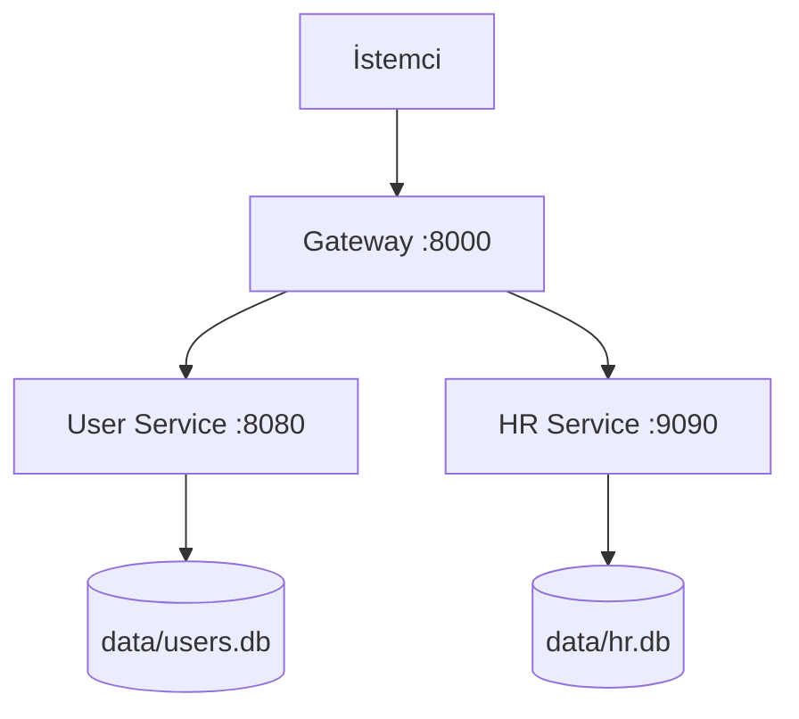

# Go ile REST ve gRPC: sıfırdan proje rehberi

Bu proje, aynı işi yapan iki uygulamanın farklı yollarla nasıl haberleşebileceğini gösterir. Bir uygulamada HTTP istekleri ve JSON kullanılır; diğerinde gRPC ve Protocol Buffers kullanılır.

İki uygulama da kullanıcı bilgilerini ve yıllık izin kayıtlarını saklar. Birini çalıştırmak için diğerine ihtiyaç yoktur. Bu klasörde bulunan diğer projeler bu örneğin parçası değildir.

## Nereden başlamalıyım?

Önce bu sayfadaki temel kavramları oku. Sonra aşağıdaki rehberlerden birini aç. Her rehber kendi uygulamasının dosyalarını, fonksiyonlarını ve örnek istek akışını açıklar.

| Rehber | Ne öğreneceksin? |
| --- | --- |
| [REST sürümü](https://github.com/Archmetrus/project-rest) | Bir HTTP isteğinin Gateway'den geçip SQL sorgusuna dönüşmesini |
| [gRPC sürümü](https://github.com/Archmetrus/project-grpc) | Bir `.proto` tanımının Go metotlarına ve uzaktaki servis çağrılarına dönüşmesini |

İlk kez karşılaşıyorsan REST rehberinden başlamak yararlıdır: terminalden gönderdiğin isteğin metnini ve dönen JSON'u doğrudan görebilirsin.

## 1. Uygulama ne yapıyor?

Bir şirket için küçük bir kayıt uygulaması düşün:

- **User Service**, çalışanların adını, e-posta adresini ve adresini tutar.
- **HR Service**, yıllık izin kayıtlarını tutar.
- **Gateway**, dışarıdan gelen isteği ilgili servise iletir.

Kayıt ekleyebilir, okuyabilir, değiştirebilir ve silebilirsin. Bu dört işlemin İngilizce baş harfleri **CRUD** olarak kısaltılır: Create, Read, Update, Delete. Listeleme de okuma işleminin bir çeşididir.

Bu örnekte ekranı olan bir web sitesi yoktur. Uygulamayı REST tarafında `curl` ile, gRPC tarafında Go istemcisiyle kullanırsın. İstemci, servise istek gönderen program demektir.

## 2. Mimari: hangi parça kiminle konuşuyor?



Gateway'i bir danışma masası gibi düşünebilirsin. Kullanıcılarla ilgili bir iş geldiğinde User Service'e, izinlerle ilgili bir iş geldiğinde HR Service'e yönlendirir. Kaydı kendisi veritabanına yazmaz.

Üç kutu, **ayrı çalışan üç programdır**. Hepsi aynı bilgisayarda çalışabilir. Port, aynı bilgisayardaki hangi programa ulaşılacağını belirleyen kapı numarası gibidir. `127.0.0.1:8000`, bu bilgisayardaki 8000 numaralı porta git demektir.

Her servis kendi veritabanına sahiptir. `users.db` ve `hr.db`, SQLite tarafından kullanılan dosyalardır. SQLite için ayrıca bir veritabanı sunucusu başlatılmaz. Programı kapatmak bu dosyalardaki kayıtları silmez.

REST sürümünde diyagramdaki istemci–Gateway ve Gateway–servis bağlantılarının tamamında HTTP + JSON kullanılır. gRPC sürümünde bu bağlantıların tamamında gRPC + Protocol Buffers kullanılır.

## 3. Saklanan veriler

Veritabanındaki bir **tabloyu** başlıkları olan bir çizelge gibi düşün. Her satır bir kayıt, her sütun bir bilgidir. Go tarafındaki `struct`, bu bilgileri programın belleğinde bir arada tutar.

| Kayıt | Alan | Anlamı |
| --- | --- | --- |
| User | `id` | Veritabanının verdiği kullanıcı numarası |
| User | `name` | Kullanıcının adı |
| User | `email` | E-posta adresi |
| User | `address` | Adresi |
| Leave | `id` | İzin kaydının kendi numarası |
| Leave | `user_id` | İznin ait olduğu kullanıcı numarası |
| Leave | `start_date` | Başlangıç tarihi; metin olarak tutulur |
| Leave | `end_date` | Bitiş tarihi; metin olarak tutulur |

Örneğin `id=12, user_id=3` olan bir izin, “3 numaralı kullanıcıya ait 12 numaralı izin kaydı” demektir. Aynı kullanıcıya ait başka bir izin `id=13, user_id=3` olabilir. İzin silerken kullanıcı numarası yerine izin kaydının numarasını kullanırsın.

`id` ve `user_id` Go'da `int64`, yani tam sayı türündedir. Diğer alanlar `string`, yani metindir. Yeni kayıt numarasını SQLite üretir. Güncelleme, belirtilen kaydın bütün veri alanlarını değiştirir; yalnızca gönderilen alanları değiştiren kısmi bir güncelleme değildir. Gönderilmeyen metin alanları boş, sayısal alanlar sıfır olur.

Bu eğitim örneğinde tarih sırası, çakışan izin, kalan izin hakkı veya kullanıcının gerçekten var olup olmadığı kontrol edilmez. Tarih alanlarına metin yazılır; örneklerde `YYYY-MM-DD` biçimi kullanılır. Kullanıcı silindiğinde HR kayıtları kendiliğinden silinmez. Ayrı veritabanları arasında foreign key kurulmamıştır. Kimlik doğrulama ve yetkilendirme de yoktur; bağlantılar geliştirme amacıyla şifrelemesizdir.

## 4. Kod neden klasörlere ayrılmış?

| Klasör veya dosya | Görevi |
| --- | --- |
| `cmd/` | Çalıştırılabilir programların başlangıç noktaları |
| `internal/config/` | Port ve veritabanı yolu gibi ayarlar |
| `internal/transport/` | Ağdan gelen isteği karşılayan ve cevabı gönderen kod |
| `internal/store/` | Veritabanını açan ve SQL sorgularını çalıştıran kod |
| `migrations/` | Tabloları oluşturan/değiştiren SQL dosyaları ve migration testleri |
| `integration/` | Gateway üzerinden bütün parçaları birlikte sınayan testler |
| `internal/testdb/` | Testler için geçici veritabanı hazırlayan yardımcı kod |
| `scripts/run.sh` | Derleme, migration ve üç programı başlatma adımlarını otomatikleştiren script |
| `go.mod` | Modülün adı, Go sürümü ve kullandığı kütüphaneler |
| `go.sum` | İndirilen bağımlılıkların bütünlüğünü kontrol etmekte kullanılan özetler |
| `.gitignore` | `bin/`, `data/` ve `.env` gibi dosyaları Git takibinin dışında tutan kurallar |

**Transport** isteğin hangi yolla geldiğini bilir; **store** verinin SQL ile nasıl saklanacağını bilir. Gateway'in de, store'un da her işi üstlenmesine gerek kalmaz. Arada ayrı bir “iş kuralları katmanı” yoktur; bu projede onu gerektirecek ek iş kuralları bulunmaz.

## 5. Goose ve migration ne demek?

Bir tablo oluşturmak ile o tabloya kullanıcı eklemek farklı işlerdir. **Migration**, veritabanının yapısında yapılan, dosyada saklanan değişikliktir. **Goose**, bu değişikliklerden hangilerinin uygulanmış olduğunu izler ve sıradakileri çalıştırır.

Her sürümde şu dosyalar bulunur:

| Dosya | `Up` ne yapar? | `Down` ne yapar? |
| --- | --- | --- |
| `migrations/user/000001_create_users.sql` | `id`, `name`, `email` içeren tabloyu oluşturur | Kullanıcı tablosunu kaldırır |
| `migrations/user/000002_add_address.sql` | `address` sütununu ekler | Yalnızca `address` sütununu kaldırır |
| `migrations/hr/000001_create_leaves.sql` | İzin tablosunu oluşturur | İzin tablosunu kaldırır |

Adres alanının sonradan eklenmesini sağlayan gerçek SQL şudur:

```sql
ALTER TABLE users ADD COLUMN address TEXT NOT NULL DEFAULT '';
```

Bu işlemden önce var olan kullanıcılara boş adres değeri verilir. İkinci dosyayı geri almak, sütunu ve içindeki adres verilerini kaldırır. Yeniden uygulamak kaybolan adresleri geri getirmez. User ve HR ayrı migration dizilerine sahiptir; HR'ın `000001` dosyası User'ın sırasını etkilemez.

`cmd/migrate/main.go`, komuttaki `user` veya `hr` seçimine göre veritabanını ve SQL klasörünü seçer. `goose.NewProvider` bu ikisini bir araya getirir. `up` bekleyen değişiklikleri uygular, `status` durumlarını gösterir, `down` son uygulanmış değişikliği geri alır.

`migrations/migrations.go` içindeki `go:embed`, SQL dosyalarını derlenen programa dahil eder. Makineye ayrıca genel bir `goose` komutu kurman gerekmez.

**Normal CRUD istekleri migration çalıştırmaz.** Başlatma scripti önce migration komutunu çalıştırır, ardından servisleri açar. Servisleri ayrı ayrı başlatırsan migration adımını önce sen yapmalısın.

## 6. Ayarlar nasıl değişiyor?

Her modüldeki `internal/config/config.go` dosyasının `Load()` fonksiyonu ayarları okur. `Env()` yardımcı fonksiyonu, ortam değişkeni doluysa onu; yoksa varsayılan değeri kullanır. Ortam değişkeni, programa başlarken dışarıdan verdiğin bir ayardır. `.env` dosyaları otomatik okunmaz.

| Değişken | Varsayılan | Etkisi |
| --- | --- | --- |
| `GATEWAY_PORT` | `8000` | Gateway'in dinlediği port |
| `USER_PORT` | `8080` | User Service'in dinlediği port |
| `HR_PORT` | `9090` | HR Service'in dinlediği port |
| `USER_SERVICE_ADDR` | `127.0.0.1:<USER_PORT>` | Gateway'in User Service'e bağlandığı adres |
| `HR_SERVICE_ADDR` | `127.0.0.1:<HR_PORT>` | Gateway'in HR Service'e bağlandığı adres |
| `USER_DB` | `data/users.db` | Kullanıcı veritabanı dosyası |
| `HR_DB` | `data/hr.db` | İzin veritabanı dosyası |

Dosya yolları görecelidir: script her zaman kendi proje klasörüne geçtiği için her sürüm kendi `data/` klasörünü kullanır. İki sürümün varsayılan portları aynı olduğundan önce birini durdurup diğerini çalıştır. Aynı anda çalıştırmak istersen bir sürümün üç portunu da değiştir; komutlar sürüm rehberlerinde bulunur.

## 7. Go kodunda sık göreceğin ifadeler

| İfade | Bu projede anlamı |
| --- | --- |
| `package main` ve `func main()` | Çalıştırılabilir programın başladığı yer |
| `import` | Başka paketin kodunu kullanma |
| `type User struct` | Kullanıcının alanlarını bir araya getirme |
| `func (s UserStore) Get(...)` | `UserStore` üzerinde çağrılabilen bir metot tanımlama |
| `*sql.DB`, `&value` | Bir değere işaretçiyle erişme; `Scan` gibi fonksiyonların sonucu o alana yazabilmesini sağlama |
| `(User, error)` | Hem sonucu hem olası hatayı döndürme |
| `if err != nil` | Bir hata oluşup oluşmadığını kontrol etme |
| `defer db.Close()` | İçinde bulunulan fonksiyondan çıkarken bağlantıyı kapatma |
| `context.Context` | İstek iptalini ve zaman sınırını alt çağrılara taşıma |
| `go func() { ... }()` | Bir işi ayrı bir goroutine'de, diğer işlemlerle eşzamanlı yürütme |

Bunların hepsini baştan ezberlemene gerek yok. Sürüm rehberindeki tek bir kullanıcı ekleme akışını kodla birlikte izlemek, parçaların neden var olduğunu görmeni sağlar.
